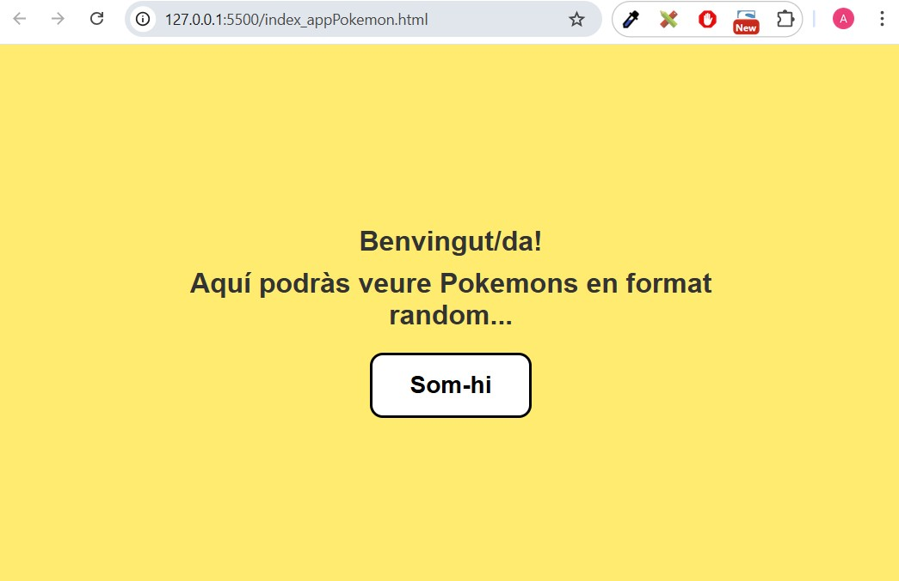
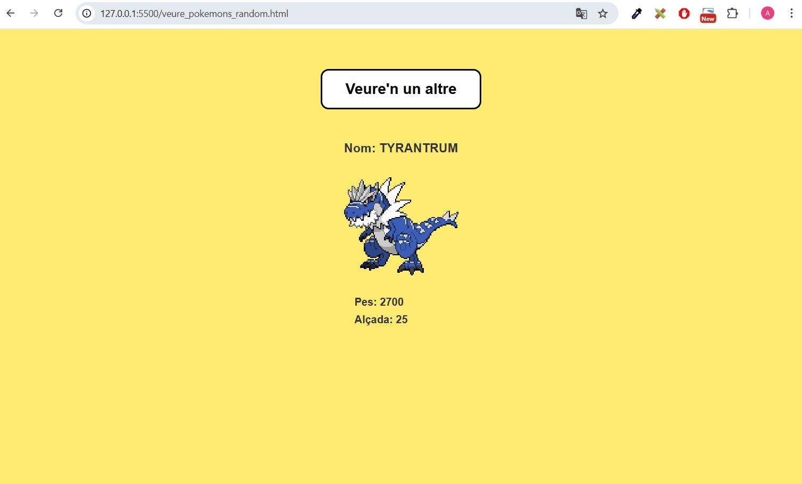

## my_poke_app és una aplicació bàsica creada per mi mateix per obtenir dades des de la Pokeapi (https://pokeapi.co/) amb un fetch-await i després mostrar-les. Cada cop que l'usuari premi el botó apareix un nou Pokémon random.

+ Imatge de la pàgina de inici 
+ Imatge de la pàgina amb un Pokémon random 
Es poden afegir més característiques per cada visualització